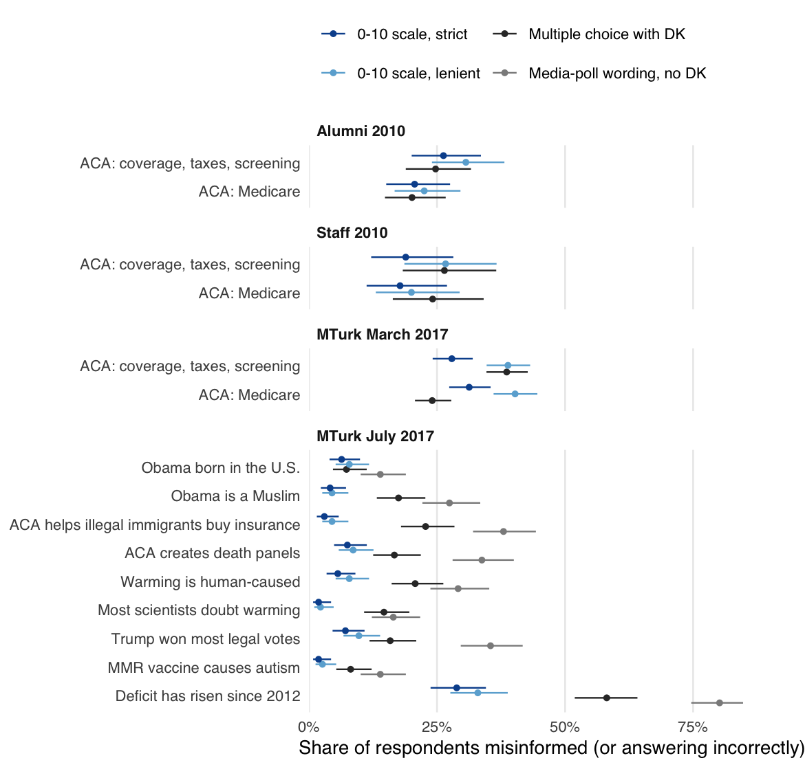

## The Waters of Casablanca: On Political Misinformation

Robert C. Luskin and Gaurav Sood

Misinformation is a confidently held false belief. The paper separates it from
knowledge, mere belief, and ignorance, and argues that multiple-choice items
cannot tell misinformation from guessing and inference. It proposes asking how
definitely true or false each statement is on a 0-10 scale and tests that
measure against multiple-choice items in four surveys that randomly assigned
respondents to one format or the other.

<p align="center">
  
</p>

### Repository

| Path | Contents |
|---|---|
| `data/raw/` | The four survey files, anonymized; see [data/README.md](data/README.md) |
| `docs/propositions.csv` | Every statement, its key (true, false, or dropped), and the basis for the key |
| `docs/mc_options.csv` | How each multiple-choice answer is scored |
| `docs/recode_ledger.csv` | Decisions that differ from earlier analyses of these data |
| `docs/citations.csv` | How each cited work was checked |
| `R/` | Functions: reading and checking the data (`sources.R`), scoring (`beliefs.R`), estimates (`analysis.R`), figure style, table output |
| `scripts/` | `run_all.R` writes `tabs/*.csv`; `figures.R` writes `figs/`; `tables.R` writes LaTeX tables and number macros |
| `ms/` | `main.tex`, `references.bib`, and the compiled `main.pdf` |
| `tests/testthat/` | Reproductions of earlier published numbers, scoring unit tests, and a check that the data carry no direct identifiers |

### Running it

```
make restore   # install the package versions in renv.lock
make check     # analysis, figures, tables, manuscript, lint, tests
```

The manuscript needs XeLaTeX and latexmk. Every number in the text comes from
`tabs/macros.tex`, which `scripts/tables.R` writes from the analysis output.
